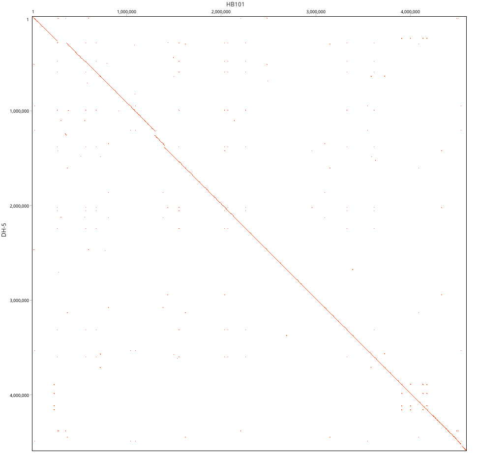

# Truthset analysis - Haploid variant calling in Nanopore data
Benchmarking haploid variant identification accuracy of varaint callers.

This repository contains scripts, reference sequences and templates, for benchmarking haploid variant affienciency in MinION/GridION Nanopore reads.
Raw reads located at bioproject [PRJNA1245633](https://www.ncbi.nlm.nih.gov/bioproject/1245633)   

## Truthset composition
### Plasmid dataset
Cointains chimeric plasmid mixtures in a controlled truth-set framework.
    - The Delta spike plasmid (pUNO-01) was used as the base donor (7179).
    - A 261 bp insert region was selected (positions 2554–2785).
    - Two chimeric plasmids were generated by replacing the 261 bp region with sequences from Wild-type and Omicron variants.

Plasmid mixtures were prepared at varying ratios to generate ground-truth complexity. Nine sets generated as well as three clonal plasmids can be found at the mentioned [repository](https://www.ncbi.nlm.nih.gov/bioproject/1245633).
 
- 85 variant positions in a 261 bp insert  
- 100 unique mutants to be detected
- **Single Nucleotide Variants:**  
  - 60 out of 85 variant positions display single nucleotide differences between all three spike plasmids (Omicron, Delta, and Wild-type).
- **Multiple Nucleotide Variants:**  
  - 15 out of 85 positions exhibit distinct nucleotides in all three spike plasmids.  
  - For these positions, the variant caller must identify two alternate alleles at the same site, resulting in a doubling of possible mutants at these locations (adding 15 × 2 = 30 mutants).
 

List of variants provided at within the [plasmid variant sheet](/plasmids/list_vector.xlsx). Reference fasta's provided in the same folder. 

| Barcode    | Omicron | Delta | Wild-type |
|------------|---------|-------|-----------|
| Barcode 1  | 1       | 0     | 0         |
| Barcode 2  | 0       | 1     | 0         |
| Barcode 3  | 0       | 0     | 1         |
| Barcode 4  | 0.8     | 0.1   | 0.1       |
| Barcode 5  | 0.8     | 0.15  | 0.05      |
| Barcode 6  | 0.8     | 0.19  | 0.01      |
| Barcode 7  | 0.1     | 0.8   | 0.1       |
| Barcode 8  | 0.15    | 0.8   | 0.05      |
| Barcode 9  | 0.19    | 0.8   | 0.01      |
| Barcode 10 | 0.1     | 0.1   | 0.8       |
| Barcode 11 | 0.05    | 0.15  | 0.8       |
| Barcode 12 | 0.01    | 0.19  | 0.8       |

### Bacterial Genomes

Two closely related *E. coli* strains (~95% similarity) were selected for sequencing: **DH5-α** and **STBL3 (HB101)**. 

Each strain was sequenced on separate flow cells. Additionally, a third flow cell contained a mixture of the two strains at varying ratios:

| Barcode | DH5-α  | STBL3  |
|---------|--------|--------|
| 1       | 0.990  | 0.010  |
| 3       | 0.950  | 0.050  |
| 4       | 0.900  | 0.100  |

Reference genomes and variant list enclosed in the [genomes](/genomes) folder. Variant list is seperated into subsitutional(list_s), deletional(list_d) and insertional(list_i) variants.   

## Codes and VCF extraction 
R scripts in respective plasmids and genomes folder will extract variant information from variant files and summarise true positives, false positives, and false negatives based on provided variant lists. Scripts within genome folder will further segregate variants into subsiutial, deletional and insertional variants. 
> [!Important]
> Scripts are designed to parse VCF files generated by [LoFreq](https://csb5.github.io/lofreq/); compatibility with VCFs from other variant callers may require parser modifications.

Sample VCFs as well as expected outputs provided within [samples](/samples) folder. 

